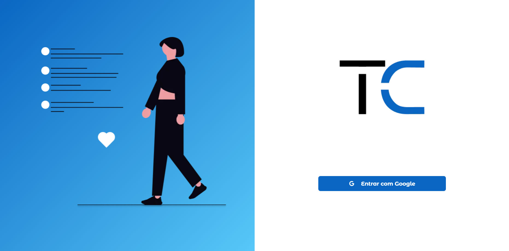
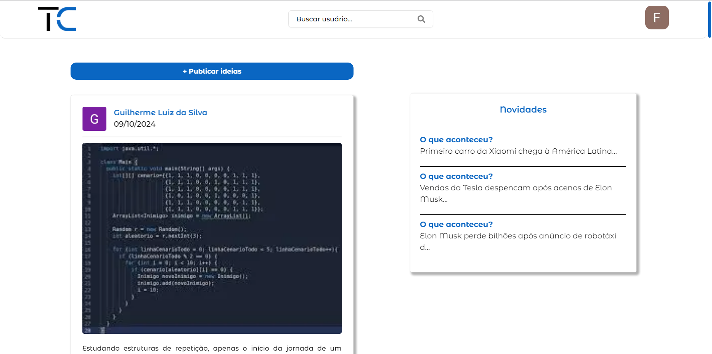
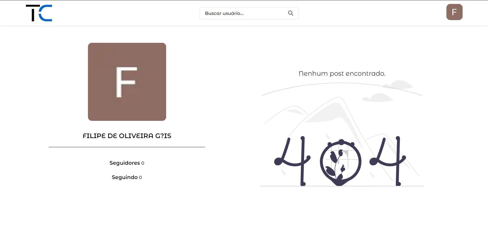
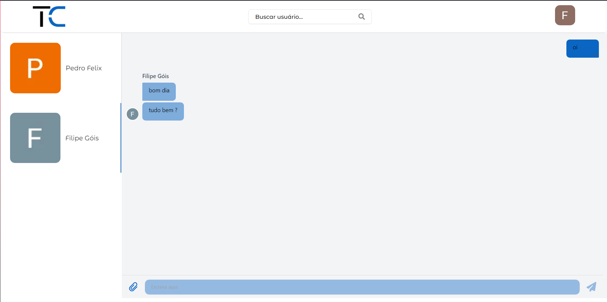
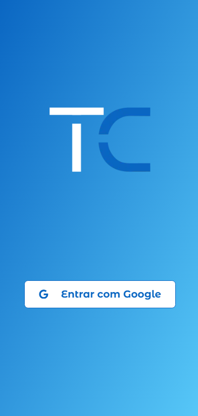
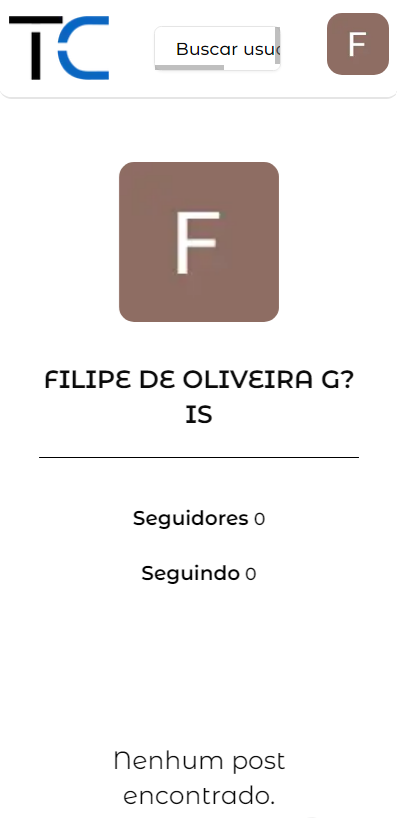
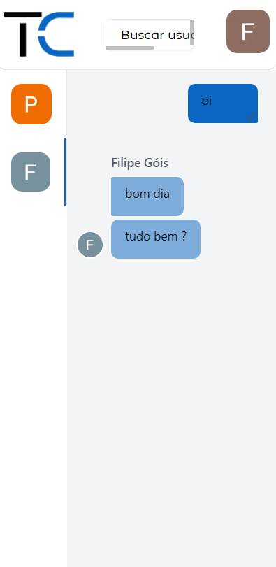

# Tech Connect

Tech Connect é um projeto de grupo criado ao final do curso de Desenvolvimento de Sistemas. Nosso objetivo é desenvolver uma rede social inovadora que conecte entusiastas da tecnologia, incluindo programadores, designers e aficionados por hardware, em um ambiente digital vibrante e acolhedor.

## 🎯 Problemática

Atualmente, as redes sociais generalistas não atendem às necessidades específicas de profissionais e entusiastas da tecnologia. Essas plataformas carecem de ferramentas adequadas para promover a interação voltada à troca de conhecimentos, projetos e experiências tecnológicas.

A **Tech Connect** visa preencher essa lacuna, proporcionando um ambiente exclusivo para que esses indivíduos possam compartilhar projetos, trocar dicas e se conectar com outras mentes brilhantes. Nossa missão é construir a rede social do futuro, que servirá como ponto de encontro para a comunidade de tecnologia.

## 💡 Solução: Tech Connect

A Tech Connect surge como uma plataforma online que permitirá aos usuários:

- Criar perfis e compartilhar suas ideias e projetos relacionados à tecnologia.
- Publicar postagens de texto e imagens em um mural digital.
- Curtir e comentar postagens para promover a interação e troca de conhecimentos.
- Acessar um feed dinâmico, repleto de novidades do mundo da tecnologia.
- Participar de conversas em tempo real por meio de chats online.

### 🚀 Diferenciais do Projeto

A Tech Connect é uma rede social focada exclusivamente no público tecnológico. Ao criar uma plataforma voltada para profissionais de TI e entusiastas da área, proporcionamos um espaço mais direcionado para o compartilhamento de projetos, dicas e tendências do setor.

Além disso, a plataforma conta com funcionalidades modernas de autenticação, publicação de conteúdos e interação entre usuários, garantindo segurança e fluidez na experiência do usuário. A seguir estão algumas das principais funcionalidades que tornam a Tech Connect única:

## 📋 Funcionalidades do Aplicativo

1. **Autenticação de Usuário com Google:**

   - Sistema de registro e login seguro com integração de autenticação via Google.

2. **Publicação de Postagens:**

   - Usuários podem publicar textos e imagens sobre seus projetos, ideias e insights sobre o mundo da tecnologia.

3. **Validação de Conteúdo com Content Moderator da Azure:**

   - Moderação de conteúdo automatizada para validar descrições de postagens e comentários, impedindo o uso de palavras indevidas ou ofensivas.

4. **Comentários:**

   - Sistema de comentários com validação automática, permitindo interações seguras e adequadas em tempo real, fomentando discussões e trocas de ideias.

5. **Sistema de Curtidas:**

   - Possibilidade de curtir postagens e demonstrar apoio, com um contador de curtidas visível em cada postagem.

6. **Chat Online em Tempo Real:**

   - Funcionalidade de chat em tempo real utilizando **Microsoft SignalR**, permitindo que os usuários enviem e recebam mensagens instantaneamente.
   - As mensagens são armazenadas no banco de dados para que possam ser recuperadas e visualizadas posteriormente.

7. **Sistema de Seguidores:**

   - Os usuários podem seguir outros perfis e remover seguidores, promovendo a conexão entre profissionais e entusiastas da área.

8. **Animações com Framer Motion:**
   - Animações dinâmicas e suaves em toda a aplicação, proporcionando uma experiência visual fluida e agradável para os usuários.

## 🔧 Ferramentas Utilizadas

### Back-end:

- **Linguagem:** C#
- **ORM:** Entity Framework
- **Banco de Dados:** SQL Server
- **Real-time Communication:** SignalR

### Front-end:

- **Framework:** Next.js
- **Linguagem:** TypeScript
- **Estilização:** Tailwind CSS
- **Validação de Formulários:** React Hook Form + Zod
- **Animações:** Framer Motion

### Integrações e Serviços:

- **Armazenamento de Imagens:** Azure Blob Storage
- **Moderação de Conteúdo:** Azure Content Moderator
- **CI/CD:** Azure DevOps
- **Controle de Versão:** Git

<h2>👥 Integrantes do Projeto</h2>
<ul>
    <li><a href="https://www.linkedin.com/in/filipe-góis/" target="_blank"><strong>Filipe Góis</strong></a> - Desenvolvedor Full Stack</li>
    <li><a href="https://www.linkedin.com/in/guilherme-luiz-da-silva-7685a2237/" target="_blank"><strong>Guilherme Luis</strong></a> - Desenvolvedor Front-End</li>
    <li><a href="https://www.linkedin.com/in/guilherme-pereira-monte-413b62270/" target="_blank"><strong>Guilherme Monte</strong></a> - Desenvolvedor Back-End/Scrum Master</li>
    <li><a href="https://www.linkedin.com/in/pedro-felix-b24818238/" target="_blank"><strong>Pedro Felix</strong></a> - Desenvolvedor Back-End</li>
    <li><a href="https://www.linkedin.com/in/richard-felintro/" target="_blank"><strong>Richard Felintro</strong></a> - Desenvolvedor Front-End</li>
</ul>

## 📸 Exemplos Visuais do Projeto

<!-- desktop -->

- ## Fluxo no Desktop:

    <figure>
        
        <figcaption>Tela de autenticação Desktop</figcaption>
    </figure>
    <figure>
        
        <figcaption>Tela Home Desktop</figcaption>
    </figure>
    <figure>
        
        <figcaption>Tela De Perfil Desktop</figcaption>
    </figure>
     <figure>
        
        <figcaption>Tela De Chat Desktop</figcaption>
    </figure>

- ## Modais Da Aplicação

    <figure>
      
        <figcaption>Modal de comentário de uma publicação</figcaption>
    </figure>
    <figure>
      
        <figcaption>Modal para cadastro de publicação</figcaption>
    </figure>
    <figure>
      
        <figcaption>Validação de conteúdo com Azure Content Moderator.</figcaption>
    </figure>
    <figure>
      
        <figcaption>Validação de cadastro da postagem.</figcaption>
    </figure>
    <figure>
      
        <figcaption>Modal para exibição dos seguidores do usuário.</figcaption>
    </figure>
    <figure>
      
        <figcaption>Modal para exibir quem o usuário segue.</figcaption>
    </figure>

<!-- Mobile -->

- ## Fluxo no Mobile:

    <figure>
      
    </figure>
    <figure>
        
          </figure>
     <figure>
        
           </figure>
     <figure>
        
          </figure>

